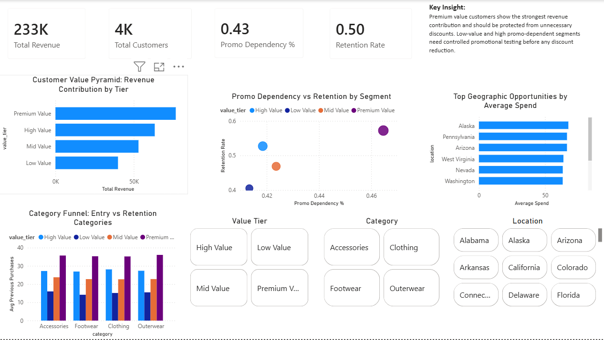

# SQL-Driven Customer Retention Strategy

## Project Overview

This project analyzes customer transaction and behavior data for a direct-to-consumer fashion brand. The goal is to identify valuable customer segments, understand promotional dependency, and recommend a retention strategy that reduces discount reliance without hurting sales.

The project follows the problem statement: **Decoding Customer Value: A SQL-Driven Retention Strategy**, where the core business question is whether the brand is building a loyal customer base or depending too heavily on promotions.

## Highlights

- End-to-end analytics pipeline using Python, SQL, and Power BI
- Customer segmentation using business rules and machine learning
- Interactive Power BI dashboard for business decision-making
- Six SQL analysis modules covering customer value, geography, segmentation, and behavioral analytics

## Business Problem

The brand has customer purchase data but lacks structured intelligence about:

- Who its most valuable customers are?
- Which customers are loyal versus discount-dependent?
- Which product categories drive repeat purchases?
- Which geographies show strong organic demand?
- How promotions should be redesigned to protect margins?

## Tools Used

- **Python**: Data cleaning and feature engineering
- **SQL**: Customer segmentation and business analysis
- **Power BI**: Interactive business intelligence dashboard
- **Excel/CSV**: Data storage and query outputs

## Tech Stack

- **Python** (Pandas, NumPy)
- **SQL** (MySQL)
- **Power BI**
- **Jupyter Notebook**

## Project Workflow

Raw Dataset
→ Data Cleaning (Python)
→ Feature Engineering
→ SQL Business Analysis
→ CSV Outputs
→ Power BI Dashboard
→ Business Recommendations

## Dataset

The dataset contains customer-level transactional and behavioral information such as:

- Age
- Gender
- Product category
- Purchase amount
- Location
- Review rating
- Subscription status
- Shipping type
- Discount applied
- Promo code usage
- Previous purchases
- Payment method
- Purchase frequency

## Feature Engineering

New customer-level features were created to support business decision-making:

- **Value Tier**: Classifies customers into Low, Mid, High, and Premium value groups
- **Promo Dependency Score**: Measures how dependent a customer is on discounts or promo codes
- **Satisfaction Flag**: Identifies customers with strong review ratings
- **Retention Score**: A behavioral proxy derived from previous purchases to estimate customer    retention in the absence of explicit churn labels.

Since the dataset does not contain churn labels, loyalty scores, or timestamps, loyalty and retention were defined using available behavioral variables.


## SQL Analysis

SQL queries were used to answer key business questions:

1. Who are the high-value customers?
2. Which customers are loyal versus discount-dependent?
3. Which product categories are linked with stronger repeat purchases?
4. Which locations show high spend and low promo dependency?
5. What does the ideal customer profile look like?

## Power BI Dashboard


A four-panel founder dashboard was created with:

1. **Customer Value Pyramid**  
   Shows revenue contribution by customer value tier.

2. **Promo Dependency vs Retention**  
   Compares customer segments based on promotional dependency and repeat purchase behavior.

3. **Geographic Opportunity Analysis**  
   Identifies locations with strong average spend and lower promo dependency.

4. **Category Funnel**  
   Shows which categories act as entry-point categories and which categories support repeat purchases.

The dashboard is designed for a non-technical founding team to quickly understand customer value, discount reliance, and growth opportunities.

## Key Insights

- Premium Value customers contribute the strongest revenue.
- High-value customers show stronger repeat purchase behavior.
- Some customer segments show high retention even without heavy promotional reliance.
- Low-value and promo-dependent customers may require controlled promotional offers.
- Certain geographies show strong spend with lower discount dependency, suggesting organic brand pull.
- Some categories work better for acquisition, while others are stronger for retention.

## Business Recommendations

### 1. Gradual Promo Sunset Plan

The brand should not remove discounts for all customers at once. Instead, it should gradually reduce discounts for Premium and High Value customers who already show strong repeat purchase behavior.

### 2. Replace Discounts with Loyalty Benefits

For valuable customers, direct discounts can be replaced with:

- Early access to new collections
- Free shipping
- Exclusive product drops
- Loyalty rewards

### 3. Continue Controlled Promotions for Sensitive Segments

Low-value and promo-dependent customers should still receive offers, but through controlled mechanisms such as:

- Minimum order value discounts
- Category-specific discounts
- Limited-time campaigns

### 4. Target High-Spend, Low-Promo Regions

Marketing campaigns should prioritize locations where customers already show high average spend and low promo dependency.

## Final Recommendation

The brand should shift from broad discounting to segment-based promotional control. This allows the company to protect revenue, reduce unnecessary discounting, improve margins, and retain its most valuable customers.

## Project Structure

```text
CUSTOMER_RETENTION/
│
├── dashboard/
│   ├── dashboard.pbix
│   └── powerbi_dashboard.png
│
├── data/
│   ├── raw/
│   └── processed/
│
├── notebooks/
│   ├── 01_data_cleaning.ipynb
│   ├── 02_feature_engineering.ipynb
│   └── 03_customer_segmentation.ipynb
│
├── outputs/
│   ├── category_analysis.csv
│   ├── customer_pyramid.csv
│   ├── customer_segment.csv
│   ├── customer_segment_comparison.csv
│   ├── geo_analysis.csv
│   └── ideal_customer_profile.csv
│
├── reports/
│   ├── business_summary.md
│   └── retention_playbook.md
│
├── sql/
│   ├── 01_customer_value_pyramid.sql
│   ├── 02_category_analysis.sql
│   ├── 03_geographical_analysis.sql
│   ├── 04_ideal_customer_profile.sql
│   ├── 05_customer_segment_analysis.sql
│   └── 06_customer_segment_comparison.sql
│
├── requirements.txt
├── .gitignore
└── README.md
```

## Future Improvements

- Incorporate transaction timestamps to perform cohort and time-series retention analysis.
- Replace proxy retention metrics with true churn labels.
- Deploy the dashboard using Power BI Service.
- Automate the SQL analysis pipeline with scheduled refreshes.

---

## 🧑‍💻 Author

**Devansh Singh**

B.Tech Biotechnology at
Indian Institute of Technology Guwahati

---
